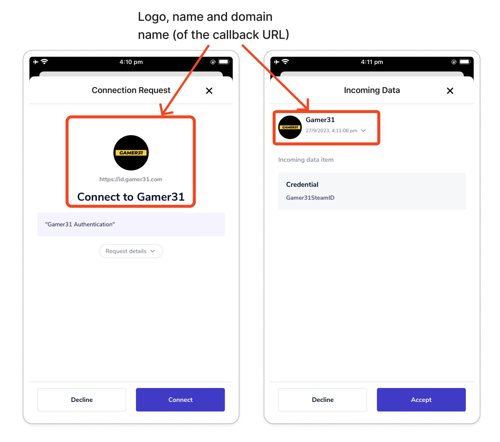
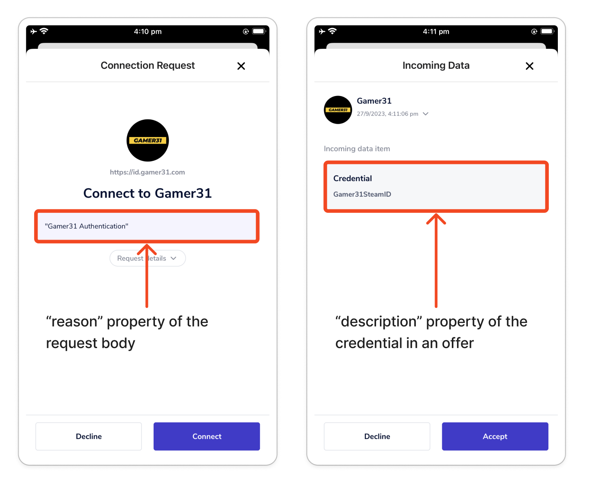

# Privado ID (fmr Polygon ID)

The Verida Wallet supports Privado ID verifiable credentials on the Privado ID myrtle. This allows users to receive and store Privado ID credentials as well as reply to proof requests in a privacy-preserving way thanks to Privado ID Zero-Knowledge technology.

To learn more about Privado ID, [check our Blog post](https://news.verida.io/polygon-id-and-verida-make-zero-knowledge-credentials-accessible-to-all-fc0ac17538c9) and head over to their [website](https://polygon.technology/polygon-id) and [developer documentation.](https://github.com/0xPolygonID)

Here's a demo video showing the credential flow and user experience:



### Wallet Users[​](https://developers.verida.network/docs/extensions/credentials/polygon-id#wallet-users) 

Users can install the Verida Wallet to receive verifiable credentials from Issuers using the Privado ID technology. These credentials are stored in your Vault (your private and secured storage space on the Verida Network) and therefore shown in the Verida Wallet alongside other credentials.

Verifiers can also send you Privado ID proof requests. The Verida Wallet will automatically generate the Zero-Knowledge proof (ZKP) for you and send it to the Verifier. The Zero-Knowledge proof means no data is actually shared with the Verifier, only the fact that you have a valid credential satisfying the request.

[Check our User Guide](https://news.verida.io/user-guide-get-started-with-polygon-id-zero-knowledge-credentials-in-the-verida-wallet-f1d6f953f285) for more information and a walkthrough on how to use the Verida Wallet with Privado ID.

### Credential Issuers and Verifiers[​](https://developers.verida.network/docs/extensions/credentials/polygon-id#credential-issuers-and-verifiers) 

You can suggest your users to install and use the Verida Wallet to support your credential flows. The Verida Wallet is a mobile app available on iOS and Android and is free to use.





Feel free to [contact us](https://www.verida.network/ecosystem#partner) for any questions or partnership opportunities.

#### Issuing a Privado ID credential[​](https://developers.verida.network/docs/extensions/credentials/polygon-id#issuing-a-polygon-id-credential) 

Your application can issue a credential to a user in many different ways. A comprehensive list is available in the [Privado ID Issuer documentation](https://0xpolygonid.github.io/tutorials/issuer/issuer-overview/) and includes; running an issuer node, using a javascript SDK or issuing on-chain via a smart contract.

Regardless of the process used to issue a credential, the end result will be the generation of a credential offer that can be signed by the user to “receive” their credential.

The credential offer can be transferred via a QR code or deep link that the Verida Wallet will automatically detect as a Privado ID credential and prompt the user to save to their Wallet. This credential is encrypted and backed up on the self-sovereign Verida Network, ensuring the user can easily restore their credentials on different devices, provided they backup their Verida Wallet seed phrase.

### Verifying a Privado ID credential[​](https://developers.verida.network/docs/extensions/credentials/polygon-id#verifying-a-polygon-id-credential) 

Your application can verify a zero-knowledge proof generated from a Privado ID credential stored in the user's Verida Wallet. More information is available in the [Privado ID Verification documentation](https://docs.privado.id/docs/verifier/verification-library/verification-api/).

### QR Code and Deep Linking[​](https://developers.verida.network/docs/extensions/credentials/polygon-id#qr-code-and-deep-linking) 

The Verida Wallet supports Privado ID requests and offers via QR codes and deep links. Check their [documentation](https://docs.privado.id/docs/introduction) on how to implement them in your application. We encourage the use of both methods to provide a better user experience. The Verida Wallet being a mobile app, QR codes can easily be scanned by the user's phone camera; As for the deep links, they will redirect the user directly to the Verida Wallet app if they are using your application on the same mobile device (a case where the QR code alone would not be convenient).

### Enable your branding in the Verida Wallet[​](https://developers.verida.network/docs/extensions/credentials/polygon-id#enable-your-branding-in-the-verida-wallet) 

Currently, there is no standardized method to define and retrieve the branding of a Decentralized Identifier (DID) for an entity (Issuer or Verifier). However, the Verida Wallet offers a solution by extracting relevant information from the callback URL provided in authorization and proof requests.

When a callback URL is provided, such as `https://myapp.com/api/polygonId/callback?sessionId=qwerty123456`, the Verida Wallet retrieves the webpage content from the root URL (`https://myapp.com`) and extracts the following details:

* Name of the entity (Issuer or Verifier):
  * The HTML `title` tag of the page
  * If unavailable, the domain name (e.g., `myapp.com`) is used as a fallback
* Logo of the entity (Issuer or Verifier):
  * The webpage's icon is specified by the HTML `link` tag with `rel="icon"`
    * Supported formats include .ico, .png, .svg, and .jpg
    * High-resolution icons are preferable
  * If an icon is not found, an attempt is made to fetch the favicon at `https://myapp.com/favicon.ico`
  * If neither a specified icon nor a favicon is available, a default generic logo is used in the Wallet

By following this approach, the Verida Wallet can incorporate the entity name and logo into its interface, enhancing the branding experience for users when interacting with the Verida Wallet.

<figure><figcaption></figcaption></figure>

#### Request and Offer details[​](https://developers.verida.network/docs/extensions/credentials/polygon-id#request-and-offer-details) 

For authorization/connection and proof requests, the Verida Wallet displays the `reason` property of the request, if defined.

For credential offers, the Verida Wallet displays the `description` property of the credentials.

<figure><figcaption></figcaption></figure>
