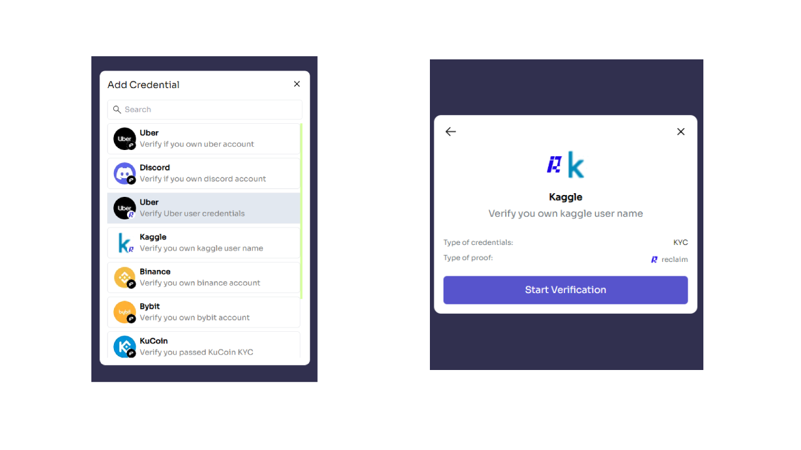
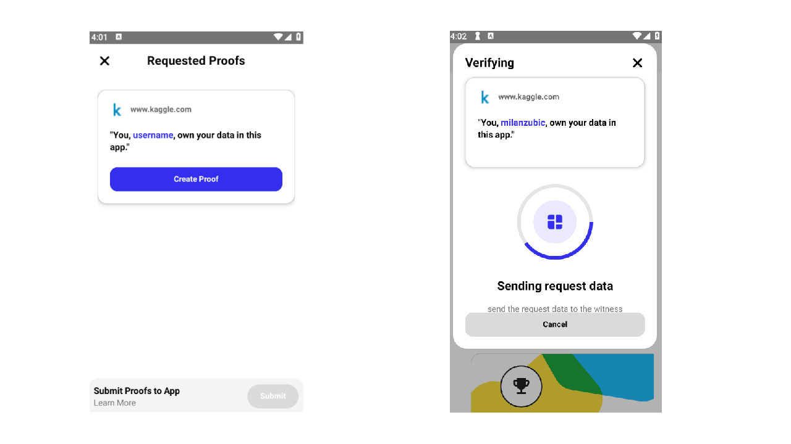

# Reclaim Protocol credential

The Verida Wallet supports Reclaim protocol verifiable credentials. This allows users to receive and store Reclaim credentials as well as reply to proof requests in a privacy-preserving way thanks to Reclaim Zero Knowledge technology.

To learn more about Reclaim protocol, [check reclaim protocol official doc](https://docs.reclaimprotocol.org/) and head over to [Reclaim Protocol Whitepaper](https://docs.reclaimprotocol.org/whitepaper).

## Wallet Users[​](https://developers.verida.network/docs/extensions/credentials/reclaim#wallet-users) <a href="#wallet-users" id="wallet-users"></a>

Users can install the Verida Wallet to receive verifiable credentials from Issuers using the Zero Knowledge technology. These credentials are stored in your Vault (your private and secured storage space on the Verida Network) and therefore shown in the Verida Wallet alongside other credentials.

Verifiers can also send you Reclaim proof requests. The Verida Wallet will automatically generate the Zero-Knowledge proof (ZKP) for you and send it to the Verifier. The Zero-Knowledge proof means no data is actually shared with the Verifier, only the fact that you have a valid credential satisfying the request.

## Request Reclaim credential[​](https://developers.verida.network/docs/extensions/credentials/reclaim#request-reclaim-credential) <a href="#request-reclaim-credential" id="request-reclaim-credential"></a>

You can request credential which is generated from reclaim protocol for your purpose.

### Example code[​](https://developers.verida.network/docs/extensions/credentials/reclaim#example-code) <a href="#example-code" id="example-code"></a>

```typescript
  const did = "..."; // Verida Did
  // Get message object from verida context
  const messaging = await context.getMessaging();

  // setup a callback to show the response
  await messaging.onMessage((data) => {
    // This callback should be called once user shares credential
    console.log('Received credentials: ', data);
  });

  const messageType = "inbox/type/dataRequest";
  const config = {
    did,
    recipientContextName: "Verida: Vault",
  };
  const dataToSend = {
    requestSchema: "https://common.schemas.verida.io/credential/base/v0.2.0/schema.json",
    filter: {
      $or: [
        { credentialSchema: "https://common.schemas.verida.io/credential/reclaim/v0.1.0/schema.json" }
      ]
    },
    userSelect: true,
  };

  // This is the DID the message will go to
  const requestFromDID = did;
  const messageSubject = "Please select your verifiable credential to verify",

  const res = await messaging.send(
    requestFromDID,
    messageType,
    dataToSend,
    msg.messageSubject,
    config
  );

  console.log("Request sent");
```

## Issuing a Reclaim Protocol credential[​](https://developers.verida.network/docs/extensions/credentials/reclaim#issuing-a-reclaim-protocol-credential) <a href="#issuing-a-reclaim-protocol-credential" id="issuing-a-reclaim-protocol-credential"></a>

The [proof-connector](https://prove.verida.network/) app can issue Reclaim Protocol credential. You need to provide `veridaDid` where generated credential will go to in the url. For example, the url can be like this:

```
 https://prove.verida.network/add-credential?veridaDid=[veridaDid]
 https://prove.verida.network/add-credential?veridaDid=[veridaDid]&schemaId=[reclaim schemaId]
```

### Available reclaim protocol schemas[​](https://developers.verida.network/docs/extensions/credentials/reclaim#available-reclaim-protocol-schemas) <a href="#available-reclaim-protocol-schemas" id="available-reclaim-protocol-schemas"></a>

```
Verify ownership of your Uber account: f3a4394b-191a-4889-9f5c-e0d70dc26fac
Verify ownership of your Kaggle account: c94476a0-8a75-4563-b70a-bf6124d7c59b
```

It redirects you to page where you select schemas. Once you select schema from Reclaim protocol, you can start process to create credentials.

<figure><figcaption></figcaption></figure>

It will redirect you to the platform (For example: Uber, Kaggle) and the the process should start.

<figure><figcaption></figcaption></figure>

Check [Reclaim protocol documentation](https://docs.reclaimprotocol.org/js) on how to generate proofs using Reclaim Protocol.

### Example code[​](https://developers.verida.network/docs/extensions/credentials/reclaim#example-code-1) <a href="#example-code-1" id="example-code-1"></a>

#### **Generate requestUrl and statusUrl from reclaim protocol**[**​**](https://developers.verida.network/docs/extensions/credentials/reclaim#generate-requesturl-and-statusurl-from-reclaim-protocol)

```typescript
  import { Reclaim } from "@reclaimprotocol/js-sdk";

  // You can create your app and schema from Reclaim protocol
  const app_id = "...";
  const schema_id = "...";
  const APP_SECRET = "...";

  const reclaimClient = new Reclaim.ProofRequest(app_id, uuidv4());

  await reclaimClient.buildProofRequest(schema_id);

  reclaimClient.setSignature(
    await reclaimClient.generateSignature(APP_SECRET)
  );
  const { requestUrl, statusUrl } = await reclaimClient.createVerificationRequest();

  return {requestUrl, statusUrl};
```

#### **Monitor statusUrl and send message to Verida Wallet**[**​**](https://developers.verida.network/docs/extensions/credentials/reclaim#monitor-statusurl-and-send-message-to-verida-wallet)

```typescript
const veridaDid = "...";

fetch(statusUrl)
  .then(async (res) => {
    const data = await res.json();
    if (data.session.status == "Ok") {
      const context = data.session.proofs[0].claimData.context;
      if (context) {
        try {
          // send context to verida wallet
          // Please refer https://developers.verida.network/docs/client-sdk/messaging#sending-messages-outbox
          console.log('Message sent');
        } catch (err) {
          console.log("Verida Message error: ", err);
        }
      }
    }
  })
```

## Verifying a Reclaim Protocol credential[​](https://developers.verida.network/docs/extensions/credentials/reclaim#verifying-a-reclaim-protocol-credential) <a href="#verifying-a-reclaim-protocol-credential" id="verifying-a-reclaim-protocol-credential"></a>

The [proof-connector](https://prove.verida.network/verify) can verify a zero-knowledge proof generated from a Reclaim Protocol credential stored in the user's Verida Wallet. More information is available in the [Reclaim Protocol Verification documentation](https://docs.reclaimprotocol.org/node/callback)[.](reclaim-protocol-credential.md)

<figure><figcaption></figcaption></figure>

### Verify the proofs[​](https://developers.verida.network/docs/extensions/credentials/reclaim#verify-the-proofs) <a href="#verify-the-proofs" id="verify-the-proofs"></a>

```typescript
import { Reclaim } from '@reclaimprotocol/js-sdk'

app.post('/callback/', async (req, res) => {
  const sessionId = req.query.callbackId
  const proof = JSON.parse(decodeURIComponent(req.body))

  const isProofVerified = await Reclaim.verifySignedProof(proof)
  if (!isProofVerified) {
    return res.status(400).send({ message: 'Proof verification failed' })
  }
})

```

### Verify the metadata[​](https://developers.verida.network/docs/extensions/credentials/reclaim#verify-the-metadata) <a href="#verify-the-metadata" id="verify-the-metadata"></a>

```typescript
import { Reclaim } from '@reclaimprotocol/js-sdk'

app.post('/callback/', async (req, res) => {
  const sessionId = req.query.callbackId
  const proof = JSON.parse(decodeURIComponent(req.body))

  const isProofVerified = await ReclaimClient.verifySignedProof(proof)
  if (!isProofVerified) {
    return res.status(400).send({ message: 'Proof verification failed' })
  }

  const context = proof.claimData.context
  const extractedParameterValues = proof.extractedParameterValues

  return res.status(200).send({ message: 'Proof verified' })
})
```
