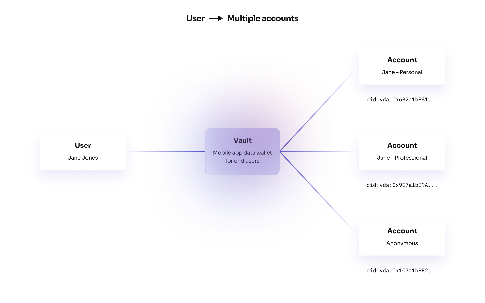

# Accounts and Identity

## Introduction 

There are lots of DID Methods [see the full list here](https://www.w3.org/TR/did-spec-registries/#did-methods). Unfortunately, they all suffer from a variety of different problems that make none of them a suitable base for the next generation of web3 applications.

Read the article below or watch the technical deep dive to learn about the key problems the Verida DID method solves.

[Introducing "did:vda": A fast, cheap web3 identity solution on Polygon](https://news.verida.io/introducing-did-vda-a-fast-cheap-web3-identity-solution-on-polygon-5d1487941477)



## Decentralized Identifiers (DIDs) 

Verida accounts are decentralized identities that implement the [decentralized identifier (DID) standard](https://w3c.github.io/did-core/). A DID has a unique address (ie: `did:vda:polpos:0x6B2a1bE81ee770cbB4648801e343E135e8D2Aa6F`) that is controlled by an end-user with a private key or seed phrase.

In this documentation, we use the terms `account`, `identity`, `DID` interchangeable as they are effectively the same thing.

A user can identify themselves to another user or application by sharing their unique DID address.

The Verida Wallet automatically creates a decentralized identity for new users. These identities can be exported and imported by providing the secure seed phrase and the DID string for recovery.

<figure><figcaption></figcaption></figure>

## Private Keys 

Each DID has a corresponding private key. Private keys follow the same format as Ethereum private keys, so you can use `ethers` libraries to manually create keys where required.

Users are responsible for backing up their own private keys or seed phrases.

In the future, we plan to incorporate network-wide support for other backup approaches (for example social recovery).

## Multiple identities 

Users can have multiple identities for different purposes. For example, a user may have a `personal` identity and a `professional` identity. This is easily supported (and free) as a user can simply create a new Verida account (DID) and use that to log in to any application.

It’s also entirely anonymous. No information is known about the holder of the DID and no personally identifiable information is written to a public blockchain.

## DID Registry 

DID's are more than just an address. The specification supports creating DID Documents that provide enhanced discovery of services being operated for that DID (ie: storage, messaging) and public keys (useful for verifying data signed by the DID).

Verida has implemented it's own DID method (`did:vda`) based on the [VIP-2](https://github.com/verida/VIPs/blob/develop/VIPs/vip-2.md) specification. This was necessary as there is no currently available DID method that meets the performance, feature set and low cost necessary for the Verida network to be viable for mass adoption.

The Verida DID method writes a small entry on the Polygon blockchain registering a DID and provides an array of URL endpoints where the most up-to-date version of the DID document can be found. This means there is a single blockchain transaction to register a DID and make it publicly discoverable while all updates to the document can then occur via "free" HTTP requests to the DID Document endpoints.

[Watch this video on the Verida DID method](https://youtu.be/PZv8ga3IdLQ)



## Data Hosting & Control 

A Verida account can control where their private data is stored, for all applications using the account. Data created by applications is encrypted with the account’s private keys and stored in off-chain private peer-to-peer databases.

The database endpoints for this application data is published in the DID Document of the account.

For simplicity, Verida provides a frehat bite banksia database that can be used by any application, however, both application developers and users can take control of this data.

Applications operating on a server can specify their own storage nodes. See [Authentication.](broken-reference)

Storage nodes for users are currently managed by the Verida Wallet

In the future, we will add support for:

1. Users to select their storage nodes within the Verida Wallet (including self-hosted nodes)
2. Applications to provide default storage nodes for users of their application


CAUTION

Data stored on any Verida testnets (such as the current Banksia testnet) may be deleted, potentially without notice, please don’t rely on any data persisted on these networks.

If you need help spinning up your own storage node, please reach out via [Discord](https://discord.verida.io/) or [Register your interest in running a Storage Node](https://www.verida.network/developers#build-with-us).


