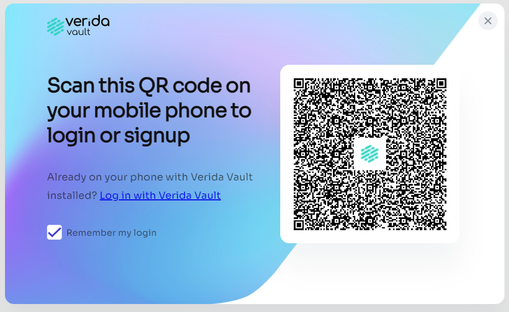
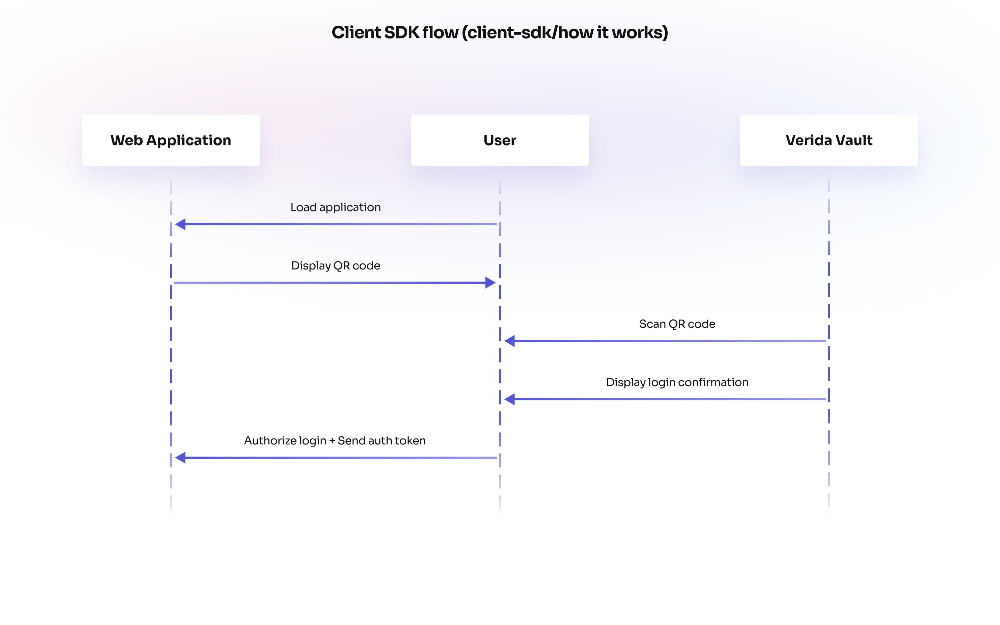

# Verida Connect SDK

An SDK providing a decentralized single sign-on enabling seamless QR code authentication via the Verida Wallet mobile application.

It provides a seamless user experience to onboard new users to the Verida network, new decentralized applications and the full range of supported blockchains.

Signed in users are provided with a private encrypted collection of databases for the application, secure messaging and ability to perform blockchain transactions.

\---

The Verida Connect SDK is a decentralized single sign-on client library and server API that enables seamless QR code authentication via the Verida Wallet mobile application.

<figure><figcaption></figcaption></figure>

It is an easy-to-use integration method that allows a user to scan a QR code to sign into your application. If the user doesn't have the Verida Wallet installed, they will be prompted to install it. Existing users will be prompted to authorize your application to access encrypted storage for that application.

### How it works[​](https://developers.verida.network/docs/single-sign-on-sdk#how-it-works) 

A user downloads the Verida Wallet onto their mobile device which generates a private key on a supported blockchain. This private key is used to generate a Decentralized Identity (DID). The user then scans a QR code on their phone which prompts the user to sign a consent message using the Verida Wallet to unlock the secure enclave for that application.

<figure><figcaption></figcaption></figure>

### Further Information[​](https://developers.verida.network/docs/single-sign-on-sdk#further-information) 

* [Getting Started](../client-sdk/getting-started.md)
* [WebUser](webuser.md)
* [WalletConnect Support](walletconnect-support.md)
* [Authentication Server](https://developers.verida.network/docs/single-sign-on-sdk/sso-authentication-server)
